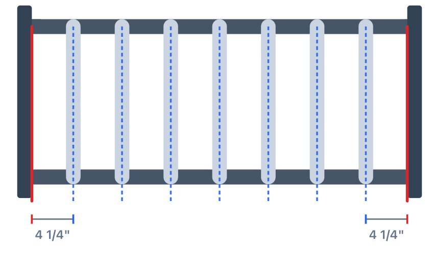

# Railwise

**Code-compliant railing spacing, in seconds.**

Enter your opening width and baluster size — Railwise gives you the exact count, equal gap, on-center spacing, and a tape-measure mark-out list. Built for level guards and stairs, in imperial or metric.

## Why Railwise

- **No more trial and error.** Stop eyeballing baluster spacing or running the math by hand.
- **Code-compliant by default.** Built around the spacing rule guardrail codes require.
- **Imperial or metric.** Feet and inches with fractions, or millimeters — your call.
- **Level guards and stairs.** Handles both layouts correctly.
- **Tape-measure ready.** Get a full mark-out list you can use on the job.

## Try it

- 🌐 Web app: [railwise-next.vercel.app](https://railwise-next.vercel.app)
- 📱 iOS: coming soon to the App Store
- 🤖 Android: coming soon to Google Play

## Built by CRD Agency

Railwise is the first app in the CRD Agency `___wise` family of construction calculators — fast, accurate tools for the numbers contractors and DIYers look up every day.

Maintained by C. DeSmet.

---

© 2026 CRD Agency
